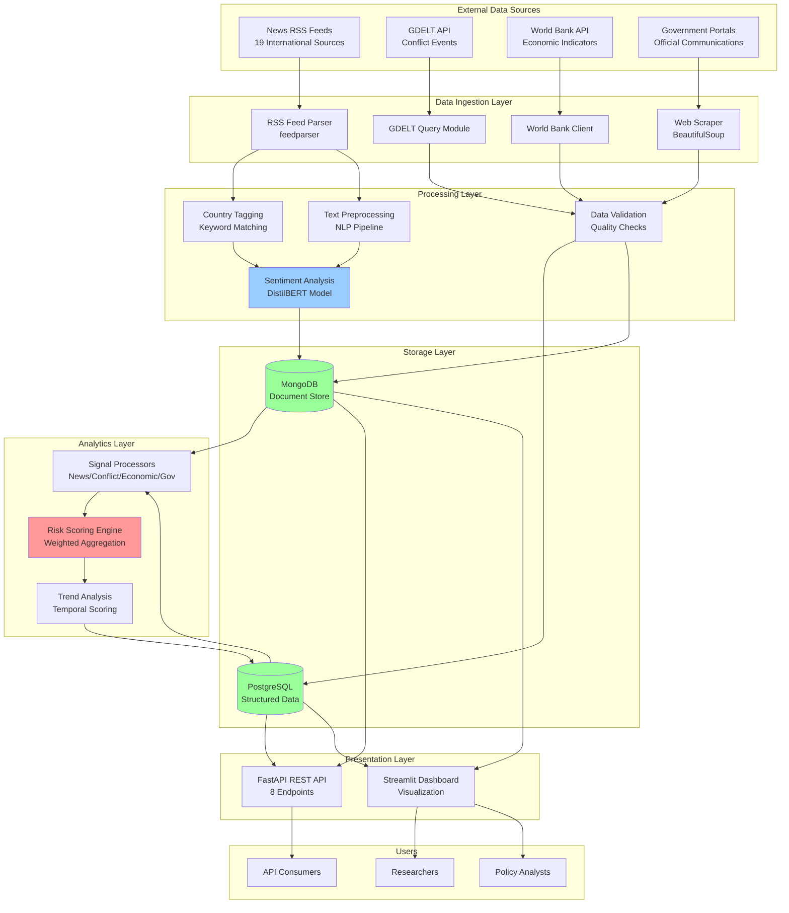
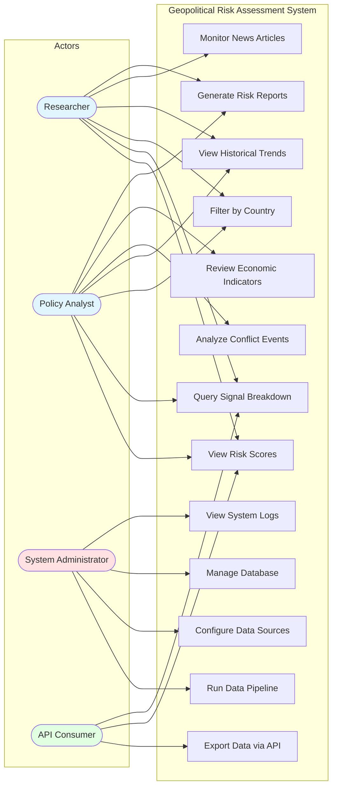
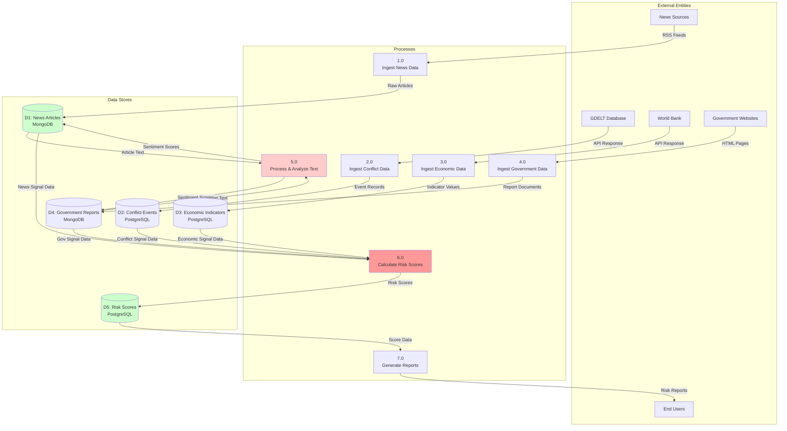
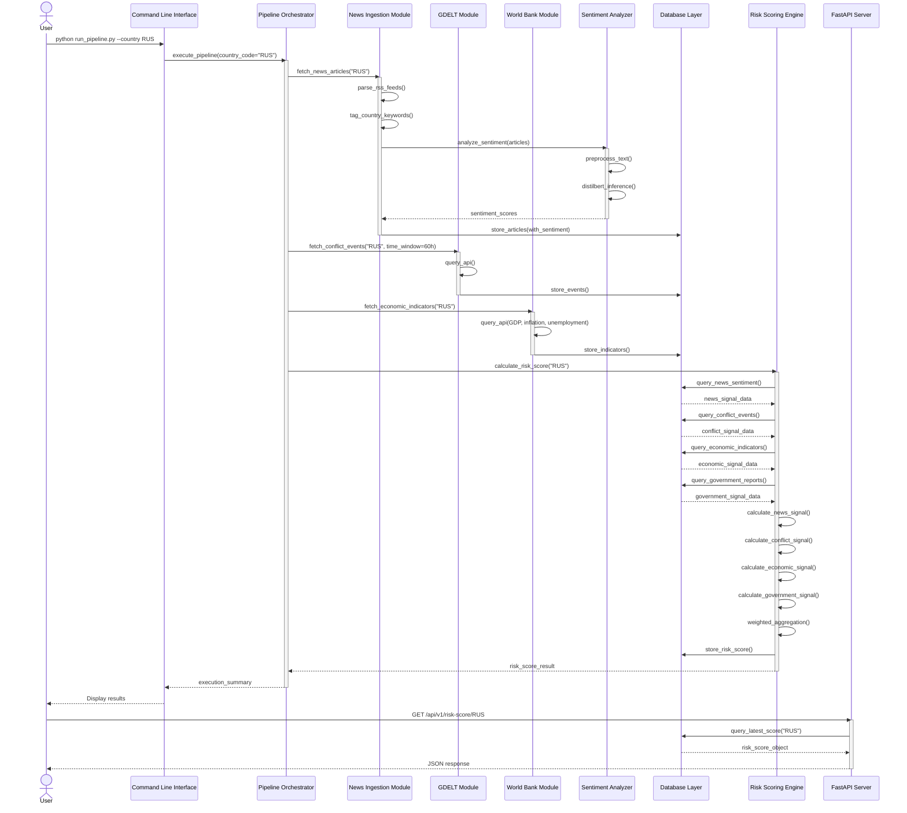

# System Diagrams for Geopolitical Risk Assessment System

This document contains all technical diagrams required for the research paper. All diagrams are provided in Mermaid syntax for easy rendering and can be exported as images for paper inclusion.

---

## 1. System Architecture Diagram (MANDATORY)

This diagram illustrates the complete system architecture including data sources, processing layers, storage, and presentation components.



**Component Description:**
- **Data Ingestion Layer:** Collects OSINT data from multiple heterogeneous sources
- **Processing Layer:** Applies NLP and validation to raw data
- **Storage Layer:** Hybrid database design (PostgreSQL + MongoDB)
- **Analytics Layer:** Implements weighted risk scoring algorithm
- **Presentation Layer:** Provides API and web interface for data access

---

## 2. Use Case Diagram (MANDATORY)

This diagram defines system functionality and actor interactions.



**Actor Responsibilities:**
- **Researcher:** Academic analysis of risk scores and trends
- **Policy Analyst:** Real-world decision support using risk assessments
- **System Administrator:** Pipeline execution and system maintenance
- **API Consumer:** Programmatic access to risk data

---

## 3. Data Flow Diagram - Level 1 (MANDATORY)

This DFD shows how data flows through the system from external sources to final risk scores.



**Process Description:**
- **P1-P4:** Data ingestion processes for each source type
- **P5:** NLP processing including sentiment analysis
- **P6:** Core risk scoring engine with weighted aggregation
- **P7:** Report generation and data presentation

---

## 4. Sequence Diagram - Risk Score Calculation (HIGHLY RECOMMENDED)

This diagram shows the complete execution sequence when calculating risk scores for a country.



**Key Interactions:**
1. User initiates pipeline through CLI
2. Parallel data ingestion from multiple sources
3. Sentiment analysis applied to textual content
4. Risk engine aggregates signals with weights
5. Results stored and accessible via API

---

## 5. Entity Relationship Diagram (HIGHLY RECOMMENDED)

This ER diagram shows the PostgreSQL database schema design.

```mermaid
erDiagram
    Country ||--o{ RiskScore : has
    Country ||--o{ ConflictEvent : records
    Country ||--o{ EconomicIndicator : has
    Country ||--o{ Alert : generates
    RiskScore ||--|| SignalBreakdown : contains

    Country {
        string country_code PK
        string name
        string region
        string iso3_code
        datetime created_at
        datetime updated_at
    }

    RiskScore {
        int id PK
        string country_code FK
        float overall_score
        string risk_level
        string trend
        datetime calculated_at
        jsonb metadata
    }

    SignalBreakdown {
        int risk_score_id PK_FK
        float news_signal_score
        int news_articles_count
        float news_mean_sentiment
        float conflict_signal_score
        int conflict_events_count
        int total_fatalities
        float economic_signal_score
        float gdp_score
        float inflation_score
        float unemployment_score
        float government_signal_score
        string government_data_status
    }

    ConflictEvent {
        int id PK
        string country_code FK
        datetime event_date
        string event_type
        string location
        int fatalities
        float goldstein_scale
        string source_url
        datetime ingested_at
    }

    EconomicIndicator {
        int id PK
        string country_code FK
        string indicator_name
        float value
        int year
        string source
        datetime retrieved_at
    }

    Alert {
        int id PK
        string country_code FK
        string alert_type
        string severity
        string message
        datetime created_at
        boolean is_resolved
    }

    User {
        int id PK
        string username
        string email
        string hashed_password
        string role
        datetime created_at
        datetime last_login
    }
```

**Schema Highlights:**
- **Country:** Central entity for all geopolitical data
- **RiskScore:** Stores calculated risk assessments with timestamps
- **SignalBreakdown:** Detailed breakdown of individual signal contributions
- **ConflictEvent, EconomicIndicator:** Source-specific structured data
- **Alert:** System-generated notifications for significant changes

**MongoDB Collections (Not shown in ER):**
- `news_articles`: {title, content, source, published_date, countries[], sentiment_score}
- `government_reports`: {title, content, source, published_date, country_code}

---

## 6. Activity Diagram - Data Pipeline Execution (OPTIONAL BUT USEFUL)

This diagram shows the step-by-step workflow of the automated data pipeline.

```mermaid
graph TD
    Start([Pipeline Start]) --> Init[Initialize Pipeline<br/>Load Configuration]
    Init --> ValidateCountry{Valid Country<br/>Code?}
    
    ValidateCountry -->|No| Error1[Log Error:<br/>Invalid Country]
    Error1 --> End1([End])
    
    ValidateCountry -->|Yes| FetchNews[Fetch News Articles<br/>from RSS Feeds]
    FetchNews --> ParseNews[Parse RSS XML<br/>Extract Article Data]
    ParseNews --> TagCountry[Apply Country Tagging<br/>Keyword Matching]
    TagCountry --> CheckArticles{Articles<br/>Found?}
    
    CheckArticles -->|No| LogWarning1[Log Warning:<br/>No Articles]
    CheckArticles -->|Yes| ProcessText[Preprocess Text<br/>Tokenization]
    
    ProcessText --> SentimentAnalysis[Sentiment Analysis<br/>DistilBERT Model]
    SentimentAnalysis --> StoreArticles[Store Articles<br/>in MongoDB]
    
    StoreArticles --> FetchConflict[Fetch Conflict Events<br/>from GDELT API]
    LogWarning1 --> FetchConflict
    
    FetchConflict --> ValidateConflict[Validate Event Data<br/>Check Completeness]
    ValidateConflict --> StoreConflict[Store Events<br/>in PostgreSQL]
    
    StoreConflict --> FetchEconomic[Fetch Economic Indicators<br/>from World Bank API]
    FetchEconomic --> ValidateEconomic[Validate Economic Data<br/>Range Checks]
    ValidateEconomic --> StoreEconomic[Store Indicators<br/>in PostgreSQL]
    
    StoreEconomic --> FetchGov[Fetch Government Reports<br/>Web Scraping]
    FetchGov --> CheckGovAvailable{Government<br/>Sources Available?}
    
    CheckGovAvailable -->|No| SkipGov[Skip Government Signal]
    CheckGovAvailable -->|Yes| ParseGov[Parse HTML<br/>Extract Documents]
    ParseGov --> AnalyzeGov[Sentiment Analysis<br/>Government Text]
    AnalyzeGov --> StoreGov[Store Reports<br/>in MongoDB]
    
    StoreGov --> CalculateSignals[Calculate Individual Signals]
    SkipGov --> CalculateSignals
    
    CalculateSignals --> NewsSignal[Calculate News Signal<br/>Mean Sentiment]
    NewsSignal --> ConflictSignal[Calculate Conflict Signal<br/>Event Count + Fatalities]
    ConflictSignal --> EconomicSignal[Calculate Economic Signal<br/>GDP + Inflation + Unemployment]
    EconomicSignal --> GovSignal[Calculate Government Signal<br/>Report Sentiment]
    
    GovSignal --> WeightedAgg[Weighted Aggregation<br/>40% Conflict + 30% Economic<br/>+ 20% News + 10% Gov]
    WeightedAgg --> DetermineLevel{Risk Level<br/>Classification}
    
    DetermineLevel -->|0-30| LowRisk[Assign: LOW Risk]
    DetermineLevel -->|30-60| ModerateRisk[Assign: MODERATE Risk]
    DetermineLevel -->|60-100| HighRisk[Assign: HIGH Risk]
    
    LowRisk --> StoreScore[Store Risk Score<br/>in PostgreSQL]
    ModerateRisk --> StoreScore
    HighRisk --> StoreScore
    
    StoreScore --> CheckThreshold{Score Change<br/>> Threshold?}
    CheckThreshold -->|Yes| GenerateAlert[Generate Alert<br/>Store in Database]
    CheckThreshold -->|No| LogComplete[Log Completion<br/>Pipeline Success]
    GenerateAlert --> LogComplete
    
    LogComplete --> DisplaySummary[Display Summary<br/>Console Output]
    DisplaySummary --> End2([End])

    style Start fill:#90EE90
    style End1 fill:#FFB6C6
    style End2 fill:#90EE90
    style SentimentAnalysis fill:#87CEEB
    style WeightedAgg fill:#FFD700
    style StoreScore fill:#98FB98
```



**Workflow Steps:**
1. **Initialization:** Validate country code and load configuration
2. **Data Collection:** Sequential ingestion from all sources
3. **Processing:** Text analysis and sentiment classification
4. **Storage:** Persist data in appropriate databases
5. **Scoring:** Calculate individual signals and aggregate
6. **Classification:** Assign risk level based on score
7. **Alerting:** Generate alerts for significant changes
8. **Reporting:** Output summary to console

---

## Diagram Usage Instructions

### For Research Paper Inclusion:

1. **Render to Images:**
   - Use Mermaid Live Editor: https://mermaid.live/
   - Copy each diagram code block
   - Export as PNG or SVG (300 DPI for print)

2. **Placement Recommendations:**
   - System Architecture: Section 5 (System Architecture)
   - Use Case Diagram: Section 5.1 (System Overview)
   - Data Flow Diagram: Section 6 (Methodology)
   - Sequence Diagram: Section 7 (Implementation Details)
   - ER Diagram: Section 7.2 (Database Schema)
   - Activity Diagram: Section 6.1 (Data Collection)

3. **Caption Format:**
   ```
   Figure X: [Diagram Type] showing [brief description]
   ```

### For Presentation:

- Use high-contrast color schemes
- Increase font sizes for readability
- Animate complex diagrams progressively
- Use separate slides for each diagram

### Technical Notes:

- All diagrams use Mermaid syntax (compatible with GitHub, GitLab, VSCode)
- Can be rendered in Markdown Preview Enhanced
- Exportable to PDF, PNG, SVG formats
- Version control friendly (text-based)

---

## Diagram Coverage Summary

| Diagram Type | Status | Section Placement | Priority |
|-------------|--------|------------------|----------|
| System Architecture | ✅ Included | Section 5 | MANDATORY |
| Use Case | ✅ Included | Section 5.1 | MANDATORY |
| Data Flow (Level 1) | ✅ Included | Section 6 | MANDATORY |
| Sequence | ✅ Included | Section 7 | HIGHLY RECOMMENDED |
| ER Diagram | ✅ Included | Section 7.2 | HIGHLY RECOMMENDED |
| Activity | ✅ Included | Section 6.1 | OPTIONAL |

**Total:** 6 diagrams covering all system aspects from architecture to execution flow.

---

**Document Information:**
- Project: AI System for Predicting Geopolitical Risk Using OSINT
- Diagram Set: Complete Technical Documentation
- Format: Mermaid Syntax (Markdown Compatible)
- Last Updated: January 2026
